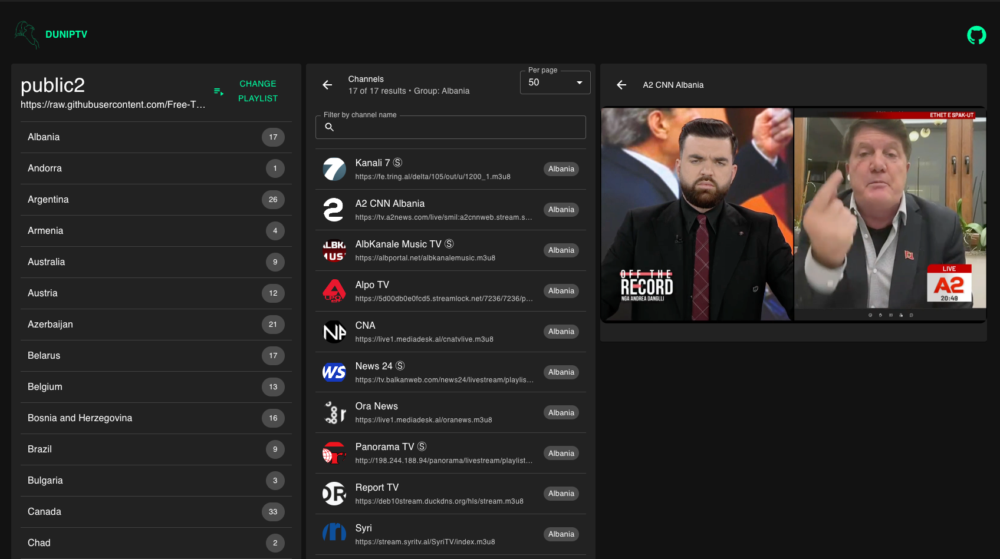
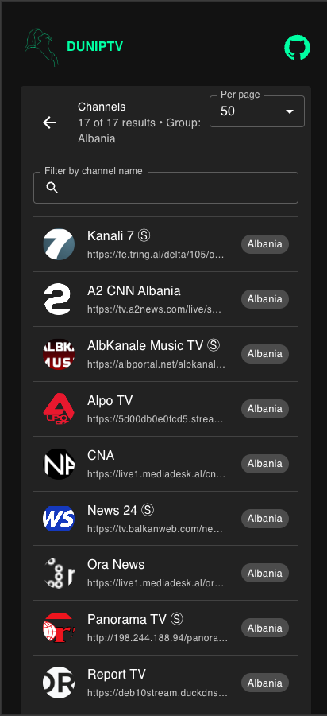

# DUNIPTV

This project is a **simple and straightforward IPTV player** built with **Next.js**.  
It does **not** use any database: **all data is stored in the browser** using `IndexedDB`.

> ✅ No external database required  
> ✅ Everything is handled on the client side  
> ✅ Ideal for loading your own IPTV playlists in `.m3u` format

### Responsive design for large and small devices



## How it works

The application allows you to:

- Load **`.m3u`** files containing IPTV channel lists.
- Group channels by **group** (e.g. Sports, Movies, Series, etc.).
- Select a channel and **play it in streaming** directly in the browser.
- Persist configuration and loaded lists in the **browser storage**, without sending your data to any external server (beyond the original stream URLs).
- Use a **proxy mode** so channel requests are made from the server where the app is hosted.


> On Smart TVs or set-top boxes, make sure the app is served over HTTPS for best compatibility.

## What is an .m3u file?

An `.m3u` file is a plain text playlist that contains a list of channels or streams.  
It usually looks like this (simplified):

```m3u
#EXTM3U
#EXTINF:-1 tvg-id="channel1" group-title="Sports", Sports Channel 1
http://example.com/stream/channel1.m3u8
#EXTINF:-1 tvg-id="channel2" group-title="Movies", Movies Channel 1
http://example.com/stream/channel2.m3u8
```

- `#EXTM3U`: marks it as an extended M3U playlist.
- `#EXTINF`: contains channel metadata:
    - **Channel name**
    - **Group** (`group-title`)
    - Other data (logo, id, etc.)
- The line immediately after `#EXTINF` is the **stream URL**.

### What does the app do with .m3u files?

1. **Loads** the `.m3u` file you provide from a URL.
2. **Parses** the content:
    - Extracts channels.
    - Reads the `group-title` to **group channels by category**.
3. Displays channels in the UI by group.
4. When you select a channel:
    - It takes the stream URL.
    - It starts the **live streaming playback** in the embedded video player.

## Proxy functionality

The application works in **proxy mode**, which means:

- Instead of having the browser player directly access the original stream URL,
- The request is first sent to the **server where the application is hosted**, and that server forwards (proxies) the request to the original source.
- Support for channels served through HTTP avoiding mixed content errors.

Benefits:

- Streams are **fetched from the server’s location**, not directly from the client.
- This may help with:
    - Geo-restrictions.
    - Hiding the original URL from the client.

## Local development (without Docker)

Assuming you have **Node.js** and **Yarn** installed:

```bash
# Install dependencies
yarn install

# Run in development mode
yarn dev
```

The application will typically be available at:

- <http://localhost:3000>


## Running with Docker

The project includes a `Dockerfile`.

### 1. Build the image

From the project root (where the `Dockerfile` is located):

```bash
docker build -t duniptv .
```

### 2. Run the container

Once the image has been built:

```bash
docker run --rm -p 3000:3000 --name duniptv duniptv
```

- `-p 3000:3000`: maps container port 3000 to port 3000 on your host.
- `--rm`: removes the container when it stops.
- `--name duniptv`: sets a friendly name for the container (optional).

After starting the container, the app will be available at:

- <http://localhost:3000>


## Notes

- This project is intended to be a **simple IPTV player**, with minimal dependencies and configuration.
- It does **not** bundle or provide any IPTV playlists by default: you must **load your own `.m3u` files**.
- The exact behavior of proxy mode and browser storage may vary slightly depending on your specific implementation details.
